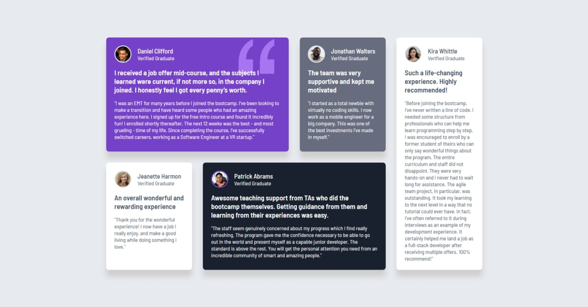

# Frontend Mentor - Testimonials grid section solution

This is a solution to the [Testimonials grid section challenge on Frontend Mentor](https://www.frontendmentor.io/challenges/testimonials-grid-section-Nnw6J7Un7). Frontend Mentor challenges help you improve your coding skills by building realistic projects.

## Table of contents

- [Overview](#overview)
  - [The challenge](#the-challenge)
  - [Screenshot](#screenshot)
  - [Links](#links)
- [My process](#my-process)
  - [Built with](#built-with)
  - [What I learned](#what-i-learned)
  - [Continued development](#continued-development)
  - [Useful resources](#useful-resources)
- [Author](#author)

## Overview

### The challenge

Users should be able to:

- View the optimal layout for the site depending on their device's screen size

### Screenshot

### Links

- Solution URL: [https://github.com/uptowngirl757/testimonials-grid-section](https://github.com/uptowngirl757/testimonials-grid-section)
- Live Site URL: [https://uptowngirl757.github.io/testimonials-grid-section/](https://uptowngirl757.github.io/testimonials-grid-section/)

## My process

### Built with

- Semantic HTML5 markup
- CSS custom properties
- Flexbox
- CSS Grid
- SCSS

### What I learned

I ues the `grid-area` property for the first time and I have to say it's amazing!! It's a really neat way to layout stuff and I'd be using it more often.

It has changed my life lol

This is also my first junior challenge on frontend mentor and man! I've really grown. Im really grateful for this platform and the wonderful community that comes with it. ❤

### Continued development

### Useful resources

I watched youTube videos - Coding2go and Net Ninja to be specific

## Author

- Frontend Mentor - [@uptowngirl757](https://www.frontendmentor.io/profile/uptowngirl757)
